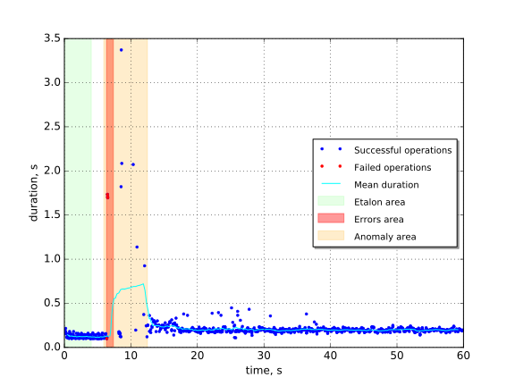
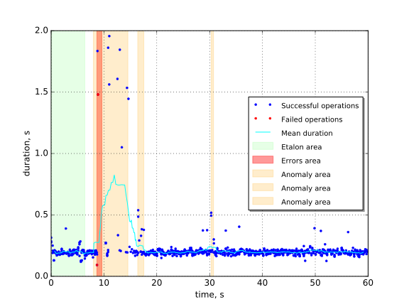
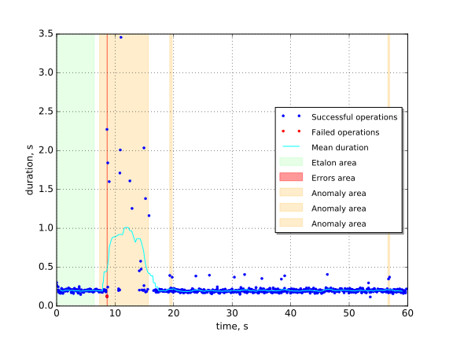

Nova flavor list with Keystone restart
======================================

Scenario
~~~~~~~~

.. code-block:: yaml

    ---
    
      Authenticate.validate_nova:
    
        -
          args:
            repetitions: 1
          runner:
            type: "constant_for_duration"
            duration: 60
            concurrency: 3
          context:
            users:
              tenants: 2
              users_per_tenant: 2
          hooks:
            -
              name: fault_injection
              args:
                action: restart random keystone service
              trigger:
                name: event
                args:
                  unit: iteration
                  at: [100]
    

Summary
~~~~~~~

+---------------+------------+-------------------------+
| Downtime, s   | MTTR, s    | Operation slowdown, s   |
+===============+============+=========================+
| 0.68 ±0.57    | 7.91 ±0.10 | 0.54 ±0.16              |
+---------------+------------+-------------------------+

Details
~~~~~~~

Run #1
^^^^^^

Errors
******

+-----+---------+---------------+
|   # |   Count | Downtime, s   |
+=====+=========+===============+
|   1 |       4 | 1.04 ±0.90    |
+-----+---------+---------------+

Anomalies
*********
+-----+---------+----------------------+-------------------------+
|   # |   Count | Time to recover, s   | Operation slowdown, s   |
+=====+=========+======================+=========================+
|   1 |      33 | 6.558 ±0.084         | 0.48 ±0.29              |
+-----+---------+----------------------+-------------------------+

Run #2
^^^^^^

Errors
******

+-----+---------+---------------+
|   # |   Count | Downtime, s   |
+=====+=========+===============+
|   1 |       3 | 0.93 ±0.75    |
+-----+---------+---------------+

Anomalies
*********
+-----+---------+----------------------+-------------------------+
|   # |   Count | Time to recover, s   | Operation slowdown, s   |
+=====+=========+======================+=========================+
|   1 |      34 | 6.53 ±0.18           | 0.42 ±0.23              |
+-----+---------+----------------------+-------------------------+
|   2 |      12 | 1.155 ±0.091         | 0.083 ±0.070            |
+-----+---------+----------------------+-------------------------+
|   3 |       4 | 0.455 ±0.058         | 0.16 ±0.15              |
+-----+---------+----------------------+-------------------------+

Run #3
^^^^^^

Errors
******

+-----+---------+---------------+
|   # |   Count | Downtime, s   |
+=====+=========+===============+
|   1 |       2 | 0.073 ±0.062  |
+-----+---------+---------------+

Anomalies
*********

+-----+---------+----------------------+-------------------------+
|   # |   Count | Time to recover, s   | Operation slowdown, s   |
+=====+=========+======================+=========================+
|   1 |      45 | 8.34 ±0.20           | 0.40 ±0.23              |
+-----+---------+----------------------+-------------------------+
|   2 |       5 | 0.412 ±0.018         | 0.047 ±0.067            |
+-----+---------+----------------------+-------------------------+
|   3 |       4 | 0.28 ±0.10           | 0.026 ±0.072            |
+-----+---------+----------------------+-------------------------+
